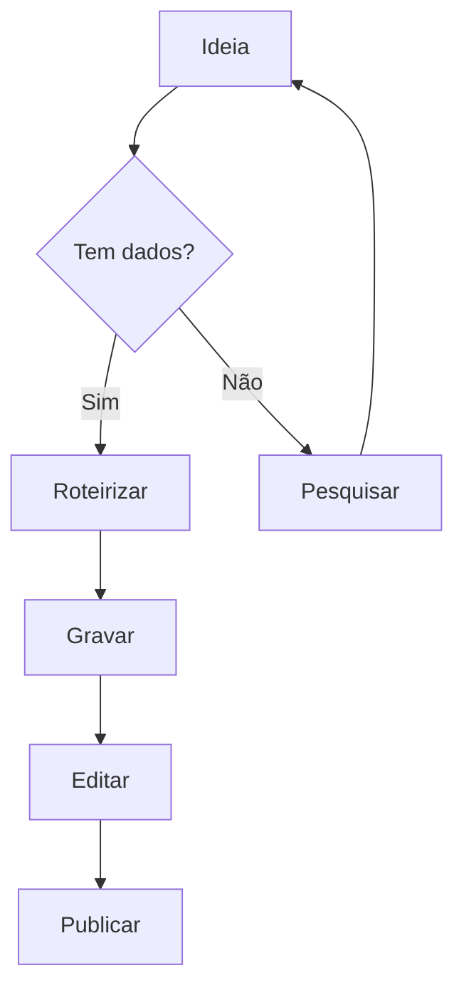
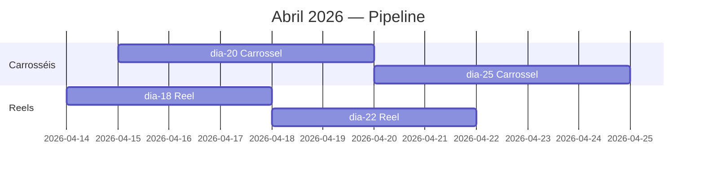
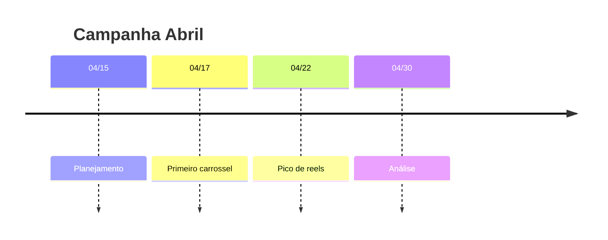
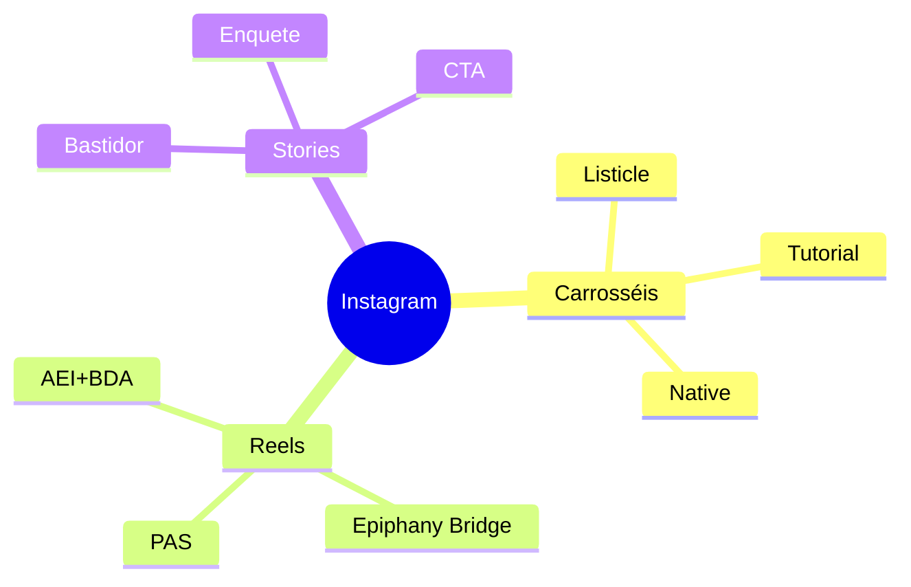
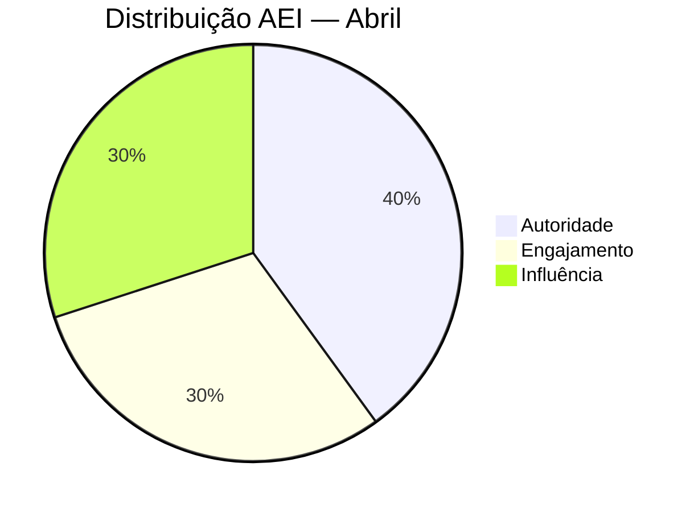

# Mermaid — Diagramas em Markdown

Skill pra gerar diagramas Mermaid válidos embutidos em markdown. Renderizam nativamente no Obsidian, GitHub, VS Code, e a maioria das ferramentas markdown modernas.

## Quando usar

- Planejar workflow de conteúdo (flowchart)
- Roadmap mensal de posts (gantt)
- Linha do tempo de campanha (timeline)
- Mapa mental de ideias (mindmap)
- Distribuição AEI (pie)
- Substituir diagramas em imagens (mais leve, versionável, editável)

## Quando NÃO usar

- Desenhos livres / wireframes visuais → use **Excalidraw** plugin
- Gráficos com dados dinâmicos → use **Dataview** com visualização

## Sintaxe principal

### Flowchart (decisões / fluxos)



### Gantt (cronograma)



### Timeline



### Mindmap



### Pie (distribuição AEI)



## Regras gerais

1. **Sempre** envolver em ` ```mermaid ... ``` ` (três backticks)
2. Nomes de nós: letras+números+underscore (ex: `A1`, `carrossel_01`)
3. Texto com espaços: entre colchetes `[texto com espaços]`
4. Decisão: entre chaves `{pergunta?}`
5. Testar render em https://mermaid.live antes de commitar se for complexo

## Integração com o projeto

Quando fizer sentido, inserir diagramas em:
- `planejamento/PIPELINE-*.md` — fluxo visual do pipeline
- `CONTEUDOS-GERADOS-AQUI/YYYY-MM/plano-mensal.md` — gantt do mês
- `_obsidian-setup/dashboards/DASHBOARD-anual.md` — pie AEI anual (complementar ao Dataview)
- `analise/` — timeline de resultados

## Reference rápido

- **Docs oficiais:** https://mermaid.js.org/
- **Editor live:** https://mermaid.live
- **Obsidian:** renderiza nativamente (ligue "Readable line length" em Settings → Editor pra melhor layout)
